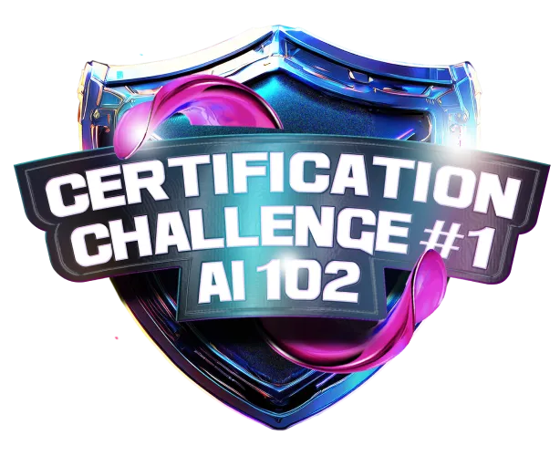

# 🚀 Bootcamp Microsoft Certification Challenge AI-102

## 🎯 Sobre o Bootcamp

Este bootcamp oferece uma oportunidade única de aprendizado e certificação em Inteligência Artificial com a Microsoft. Os participantes terão acesso ao conteúdo completo para preparação do exame AI-102, receberão um voucher para realizar a certificação e poderão participar do Innovation Challenge Hackathon da Microsoft, que oferece um prêmio de $10.000 para os vencedores.

### ✨ Destaques do Programa:

- 📚 Preparação completa para o exame AI-102
- 🎫 Voucher gratuito para certificação
- 💡 Acesso ao Hackathon da Microsoft (para certificados)
- 👨‍🏫 Conteúdo ministrado por MVPs da Microsoft
- ⚡ Treinamento prático com ferramentas Azure e OpenAI
- 📊 Foco em extração de dados de textos e documentos em massa

## 🛠️ Estrutura do Bootcamp

### 📌 Atividades Principais:

1. **Mentorias (Live)** 🎥
   - Interação com especialistas do mercado
   - Oportunidade de networking
   - Discussões sobre carreira e tecnologia
   
2. **Desafios de Código** 💻
   - Exercícios práticos
   - Aplicação dos conhecimentos adquiridos
   - Testes de proficiência

3. **Desafios de Projeto** 🏗️
   - Desenvolvimento de projetos práticos
   - Construção de portfólio
   - Aplicação real dos conhecimentos

4. **Ranking e Premiações** 🏆
   - Sistema de pontuação baseado em:
     - Interações em fóruns e salas
     - Desempenho em quizzes
     - Qualidade do código nos desafios

## 📚 Ferramentas de Aprendizado

### 🔧 Recursos Disponíveis:

- **Fórum**: 💬 Espaço para discussões técnicas e dúvidas
- **Salas de Estudo**: 👥 Ambiente para networking e troca de experiências
- **Lista de Participantes**: 📋 Acompanhamento dos colegas de turma
- **Certificados**: 🎓 Documentação oficial das conquistas no bootcamp

## ℹ️ Informações Importantes

- ⏰ Voucher gratuito disponibilizado em até 2 semanas após a conclusão
- 📅 Convites para o Hackathon Microsoft começam a partir de 06/12/2024
- 📘 Conteúdo alinhado com as últimas atualizações da certificação AI-102

## 📂 Índice de Desafios

### 🚀 Desafios de Projeto
*(A serem atualizados conforme o andamento do bootcamp)*

- Projeto 1: [Tradutor Multifuncional](https://github.com/Jcnok/Bootcamp-Microsoft-Certification-Challenge--1-AI_102/tree/master/desafios_de_projeto/desafio_1#-tradutor-multifuncional)
- Projeto 2: [Nome do Projeto]()
- Projeto 3: [Nome do Projeto]()

### 💻 Desafios de Código
*(A serem atualizados conforme o andamento do bootcamp)*

- Código 1: [Nome do Desafio]()
- Código 2: [Nome do Desafio]()
- Código 3: [Nome do Desafio]()

## 🎯 Conclusão e Opinião Pessoal

Como profissional em constante evolução na área de tecnologia, este bootcamp representa uma oportunidade excepcional de aprimoramento em Inteligência Artificial. A combinação de aprendizado prático, certificação Microsoft e a possibilidade de participar do Hackathon não só enriquece meu portfólio, mas também demonstra meu compromisso com a excelência técnica e inovação.

A escolha deste bootcamp reflete minha determinação em me manter atualizado com as tecnologias mais recentes e minha busca por desafios que me permitam crescer profissionalmente. Através dele, estou desenvolvendo habilidades práticas em Azure e OpenAI, ferramentas essenciais no cenário atual de IA.

## 📫 Contatos e Redes Sociais

Vamos nos conectar? Estou sempre aberto a novas oportunidades e networking! 🤝

### 🎯 Habilidades em Desenvolvimento

---

⭐ *Este README será atualizado regularmente com novos conteúdos e conquistas ao longo do bootcamp. Fique à vontade para entrar em contato para discussões sobre tecnologia, oportunidades de colaboração ou networking!*