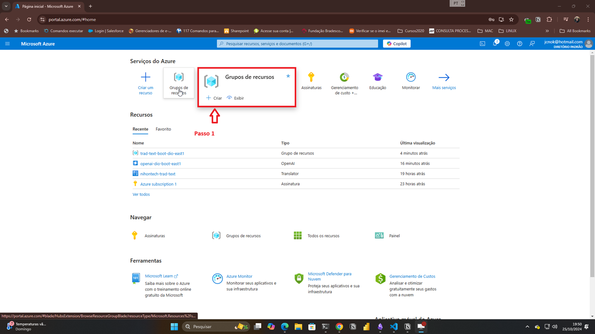
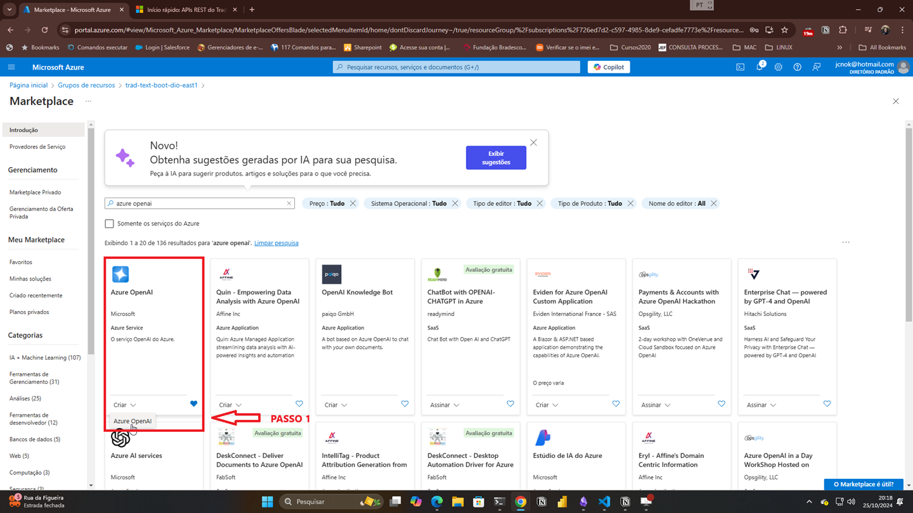
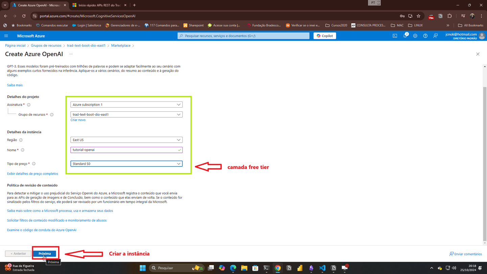
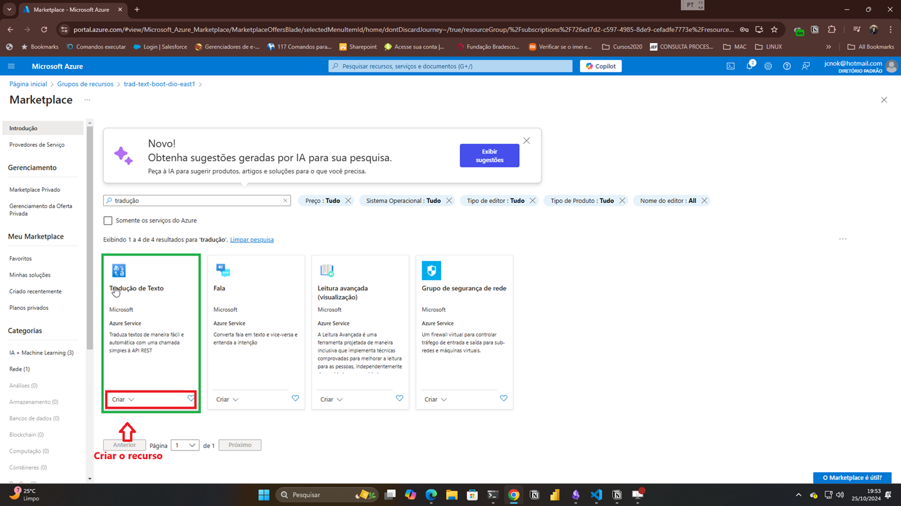
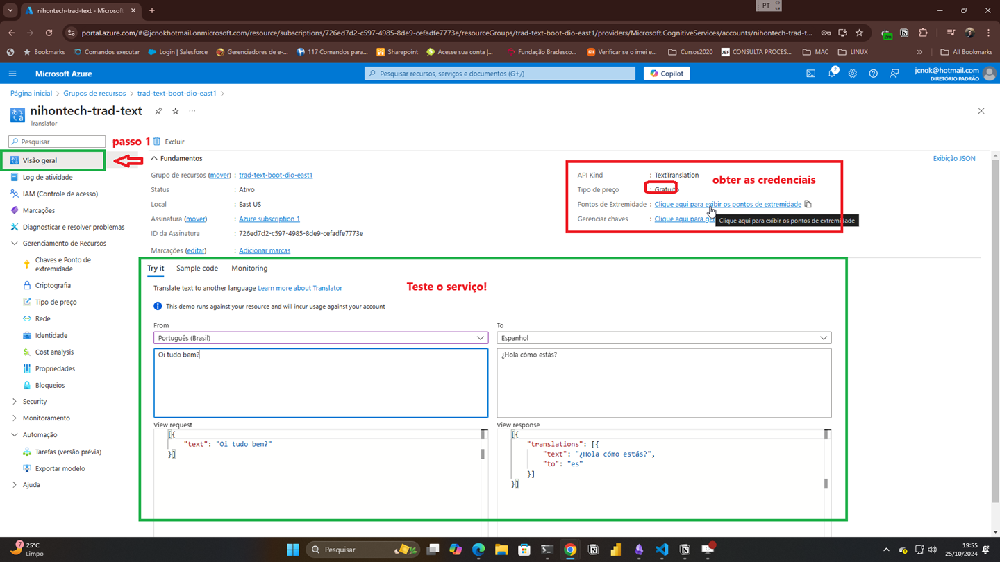

## Projeto de Tradução de Artigos Técnicos com Azure AI e Tradução de Documentos com Azure Translator

### Índice

*   Introdução
*   Contexto & Problema
*   Solução
*   Arquitetura & Tecnologias
*   Resultados & Benefícios
*   Considerações de Custo
*   Desenvolvimento

### 1. Introdução

Este projeto demonstra como traduzir artigos técnicos utilizando os serviços de Inteligência Artificial (IA) da Microsoft Azure, incluindo o Azure OpenAI e o Azure Translator. O objetivo é automatizar e simplificar o processo de tradução de conteúdo técnico, tornando-o acessível a um público mais amplo.

### 2. Contexto & Problema

A tradução de artigos técnicos apresenta desafios específicos, como a necessidade de manter a precisão terminológica e o estilo formal da escrita técnica. A tradução manual é um processo demorado e dispendioso, especialmente para grandes volumes de conteúdo.

### 3. Solução

Este projeto apresenta uma solução que automatiza a tradução de artigos técnicos utilizando os seguintes serviços:

*   **Azure OpenAI:** Um serviço de IA que fornece modelos de linguagem avançados para tradução de texto, geração de texto e muito mais.
*   **Azure Translator:** Um serviço de tradução de texto baseado em nuvem que suporta a tradução entre vários idiomas.
*   **Python & Bibliotecas:** Linguagem de programação e bibliotecas como `requests`, `BeautifulSoup`, `docx` e `langchain` são usadas para interagir com os serviços da Azure e manipular os dados.

### 4. Arquitetura & Tecnologias

A solução consiste nos seguintes componentes:

*   **Web Scraping:** O código Python extrai o texto do artigo técnico de uma URL fornecida.
*   **Pré-processamento de Texto:** O texto extraído é limpo e formatado para ser processado pelos serviços de IA.
*   **Tradução:** O texto pré-processado é enviado ao serviço Azure OpenAI ou Azure Translator para tradução para o idioma desejado.
*   **Geração de Markdown:** O texto traduzido é formatado em Markdown para fácil visualização e publicação.

### 5. Resultados & Benefícios

A solução automatiza o processo de tradução de artigos técnicos, resultando em:

*   **Eficiência:** Tradução rápida e eficiente de grandes volumes de conteúdo.
*   **Acessibilidade:** Tradução de conteúdo técnico para vários idiomas, tornando-o acessível a um público mais amplo.
*   **Consistência:** Manutenção da precisão terminológica e do estilo formal da escrita técnica.

### 6. Considerações de Custo

A utilização dos serviços Azure OpenAI e Azure Translator incorre em custos, que variam de acordo com o volume de texto traduzido. É possível utilizar a camada gratuita para volumes menores de tradução. A partir de um determinado volume, a utilização do Azure OpenAI pode ser mais econômica do que o Azure Translator.

## Passo a Passo Detalhado para o Desenvolvimento do Projeto de Tradução de Artigos Técnicos com Azure AI

Este guia detalhado descreve as etapas para desenvolver um projeto que traduz artigos técnicos usando os serviços de IA da Microsoft Azure. Ele se baseia em informações de nossas conversas anteriores e dos recursos fornecidos, com o objetivo de fornecer uma compreensão completa do processo.

### **1. Criar um Grupo de Recursos:**  No portal do Azure, crie um grupo de recursos para organizar os recursos do projeto, como o Azure OpenAI e o Azure Translator.




### **2. Provisionar o Serviço Azure OpenAI:** Crie uma instância do serviço Azure OpenAI. Selecione a região desejada (East por exemplo), escolha um nome para a instância, e opte pela camada gratuita para começar.






```python

```

###  **3. Implantar o Modelo GPT-4 Mini:** No Azure OpenAI Studio, implante o modelo GPT-4 Mini, selecionando o "Modo Básico" e a opção "Standard" para a implantação. Anote a chave de API e o endpoint do Azure OpenAI, pois você precisará deles mais tarde.


### **4. Provisionar o Serviço Azure Translator:** Crie uma instância do serviço Azure Translator no mesmo grupo de recursos. Escolha a região East US 2 para consistência, nomeie a instância e selecione a camada gratuita, que oferece tradução de até 2 milhões de caracteres.  

                                                            


### **5. Obter a Chave de Assinatura e o Endpoint do Translator:** Acesse as chaves de assinatura e o endpoint do serviço Azure Translator. Anote essas informações, pois serão usadas para autenticar e interagir com o serviço.




## Primeiro projeto - Tradução de artigos:

### **1. Importar as Bibliotecas:**:


```python
from bs4 import BeautifulSoup
import requests, uuid, json
import os
from dotenv import load_dotenv
```

### **2. Definir as Variáveis de Ambiente:** variáveis de ambiente para a chave de assinatura do Azure Translator, endpoint do Translator e endpoint do Azure OpenAI:


```python
# Carregar variáveis de ambiente do arquivo .env
load_dotenv()

API_KEY = os.getenv("AZURE_OPENAI_KEY")
key = os.getenv("TRANSLATOR_API_KEY")
endpoint = os.getenv("TRANSLATOR_ENDPOINT")
location = os.getenv("TRANSLATOR_LOCATION")
```

### **3. Criar a Função de Extração de Texto:** função Python chamada `extract_text()` para extrair texto de uma URL fornecida. Esta função deve:

*   Usar `requests.get()` para buscar o conteúdo HTML da URL.
*   Verificar se a resposta HTTP tem o código de status 200 (sucesso).
*   Criar um objeto `BeautifulSoup` para analisar o HTML.
*   Remover tags `<script>` e `<style>` do HTML.
*   Extrair o texto usando `soup.get_text()`.
*   Limpar o texto removendo caracteres desnecessários, como quebras de linha extras.
*   Retornar o texto limpo.


```python
url="https://dev.to/eric_dequ/steve-jobs-the-visionary-who-blended-spirituality-and-technology-3ppi"
def extract_text(url):
    response = requests.get(url)
    if response.status_code == 200:
        soup = BeautifulSoup(response.text, 'html.parser')
        for script in soup(["script", "style"]):
            script.decompose()
        text = soup.get_text(" ", strip=True)
        return text
    else:
        print("Falha ao buscar a URL. Código de status:", response.status_code)
        return None
extract_text(url)
```


    'Steve Jobs The Visionary Who Blended Spirituality and Technology - DEV Community Skip to content Navigation menu Search Powered by Search Algolia Search Log in Create account DEV Community Close Add reaction Like Unicorn Exploding Head Raised Hands Fire Jump to Comments Save More... Copy link Copy link Copied to Clipboard Share to Twitter Share to LinkedIn Share to Reddit Share to Hacker News Share to Facebook Share to Mastodon Report Abuse Eric Dequevedo Posted on Jun 28 • Originally published at rics-notebook.com Steve Jobs The Visionary Who Blended Spirituality and Technology # stevejobs # apple # iphone # spirituality Steve Jobs: The Visionary Who Blended Spirituality and Technology 🍎🕉️ Steve Jobs, the co-founder of Apple and the mastermind behind revolutionary products like the iPhone, was not only a tech visionary but also a deeply spiritual individual. His unique blend of Eastern spirituality and Western innovation allowed him to create technology that was not only functional but also incredibly cool and desirable. 📱✨ The Spiritual Journey of Steve Jobs 🧘\u200d♂️ From a young age, Steve Jobs was drawn to Eastern spirituality and philosophy. He famously spent seven months traveling through India in 1974, seeking spiritual enlightenment and studying Buddhism. This experience had a profound impact on his life and would later influence his approach to business and product design. 🌍🙏 One of the most significant turning points in Jobs\' spiritual journey was his encounter with the book "Be Here Now" by Ram Dass. The book, which blends Eastern spirituality with Western psychology, resonated deeply with Jobs and became a guiding force in his life. 📖💡 Jobs\' spiritual pursuits also led him to develop a connection with the Indian guru Neem Karoli Baba, also known as Maharaj-ji. Although Jobs never met Maharaj-ji in person, he felt a strong spiritual connection to the guru and sought his guidance through intermediaries. This relationship helped Jobs stay grounded and focused as he navigated the challenges of leading a rapidly growing technology company. 🕉️💼 The Intersection of Spirituality and Technology 🌐🧘\u200d♂️ Steve Jobs\' spiritual beliefs profoundly influenced his approach to technology and design. He believed that technology should not only be functional but also aesthetically pleasing and intuitive to use. Jobs\' vision was to create products that would enhance people\'s lives and bring them joy, rather than merely serving as tools. 🎨💻 The iPhone, perhaps Jobs\' most iconic creation, perfectly exemplifies this philosophy. With its sleek design, user-friendly interface, and powerful features, the iPhone revolutionized the smartphone industry and set a new standard for mobile technology. Jobs\' attention to detail and focus on user experience, informed by his spiritual outlook, made the iPhone not just a device, but a statement of style and individuality. 📱👨\u200d💻 Jobs\' spiritual approach to leadership also set him apart from other tech CEOs. He fostered a culture of innovation and creativity at Apple, encouraging his team to think differently and push boundaries. Jobs\' belief in the power of intuition and his ability to "think different" allowed him to anticipate and shape the future of technology, rather than simply reacting to market trends. 🔮💡 The Legacy of Steve Jobs 🍏🌟 Steve Jobs\' impact on the world of technology and his unique approach to blending spirituality with innovation continue to inspire and influence entrepreneurs and designers around the globe. His vision for Apple and his commitment to creating products that enrich people\'s lives have left an indelible mark on the tech industry. 🌍💻 Beyond his technological achievements, Jobs\' spiritual journey and his dedication to personal growth and self-discovery serve as a reminder that success and inner peace are not mutually exclusive. By embracing his spirituality and allowing it to guide his work, Jobs was able to achieve remarkable things while staying true to himself and his values. 🧘\u200d♂️🏆 As we reflect on the life and legacy of Steve Jobs, we can draw inspiration from his ability to blend seemingly disparate worlds – spirituality and technology – into a harmonious whole. By following our own paths to self-discovery and allowing our deepest values to inform our work, we too can create products, services, and experiences that not only change the world but also bring joy and meaning to people\'s lives. 🌈🙌 Top comments (0) Subscribe Personal Trusted User Create template Templates let you quickly answer FAQs or store snippets for re-use. Submit Preview Dismiss Code of Conduct • Report abuse Are you sure you want to hide this comment? It will become hidden in your post, but will still be visible via the comment\'s permalink . Hide child comments as well Confirm For further actions, you may consider blocking this person and/or reporting abuse Read next 🚀 pgai Vectorizer: Automate AI Embeddings With One SQL Command in PostgreSQL Avthar Sewrathan - Oct 29 Listen to Our New Podcast: "On The Board" Michael Tharrington - Oct 29 Congrats to the Wix Studio Challenge: Community Edition Winner! dev.to staff - Oct 29 ChartDB: From Zero to 1.5K GitHub Stars in 3 Days - Here’s How 🚀⭐️ Jonathan Fishner - Oct 29 Eric Dequevedo Follow Hello, I\'m Eric deQuevedo, or Ric. I enjoy studying the Art of Science, and the Science of Art.\nI am the author of the Robot Ric\nAnd Founder Of Quantum Cyber Solutions Location Orlando Florida Education University Of Florida Pronouns we/one Work Founder Quantum Cyber Solutions, Author Robot Ric Joined Jun 27, 2024 More from Eric Dequevedo The Quantum Entanglement of Ideas Exploring the Spiritual Implications of Superposition and the Mandela Effect # quantummechanics # spirituality # consciousness # mandelaeffect Robot Ric From Blog Post to Best-Selling Novel # novel # ai # spirituality # resilience Astrology and Quantum Entanglement Unveiling the Cosmic Dance # astrology # quantumphysics # spirituality # science Thank you to our Diamond Sponsor Neon for supporting our community. DEV Community — A constructive and inclusive social network for software developers. With you every step of your journey. Home DEV++ Podcasts Videos Tags DEV Help Forem Shop Advertise on DEV DEV Challenges DEV Showcase About Contact Free Postgres Database Guides Software comparisons Code of Conduct Privacy Policy Terms of use Built on Forem — the open source software that powers DEV and other inclusive communities. Made with love and Ruby on Rails . DEV Community © 2016 - 2024. We\'re a place where coders share, stay up-to-date and grow their careers. Log in Create account'


### **4. Criar a Função de Tradução de Texto:** função Python chamada `translate_article()` para traduzir o texto extraído usando o Azure Translator. Esta função deve:

*   Definir o endpoint da API de tradução.(ENDPOINT)
*   Criar um cabeçalho de solicitação com a chave de assinatura.(headers)
*   Definir o corpo da solicitação com o texto a ser traduzido.(payload)
*   Enviar uma solicitação POST para a API de tradução usando `requests.post()`.
*   Extrair o texto traduzido da resposta JSON.
*   Retornar o texto traduzido.


```python
def translate_article(text, lang):
    headers = {
    "Content-Type": "application/json",
    "api-key": API_KEY,
    }
    
    # Payload for the request
    payload = {
      "messages": [
        {
          "role": "system",
          "content": [
            {
              "type": "text",
              "text": "Você atua como tradutor de textos"
            }
          ]
        },
        {
          "role": "user",
          "content": [
            {
              "type": "text",
              "text": f"traduza: {text} para o idioma {lang} e responda apenas com a tradução no formato markdown"
            }
          ]
        },    
      ],
      "temperature": 0.7,
      "top_p": 0.95,
      "max_tokens": 900
    }
    
    ENDPOINT = "https://openai-dio-boot-east1.openai.azure.com/openai/deployments/gpt-4o-mini/chat/completions?api-version=2024-02-15-preview"
    
    # Send request
    try:
        response = requests.post(ENDPOINT, headers=headers, json=payload)
        response.raise_for_status()  # Will raise an HTTPError if the HTTP request returned an unsuccessful status code
    except requests.RequestException as e:
        raise SystemExit(f"Failed to make the request. Error: {e}")
    
    # Handle the response as needed (e.g., print or process)
    return (response.json()['choices'][0]['message']['content'])
```

* **Realizando testes:**


```python
translate_article("The future belongs to those who believe in the beauty of their dreams. - Eleanor Roosevelt","português")
```


    'O futuro pertence àqueles que acreditam na beleza de seus sonhos. - Eleanor Roosevelt'


* **Agora vamos testar com o artigo:** 'https://dev.to/eric_dequ/steve-jobs-the-visionary-who-blended-spirituality-and-technology-3ppi'


```python
url = "https://dev.to/eric_dequ/steve-jobs-the-visionary-who-blended-spirituality-and-technology-3ppi"
text = extract_text(url)
artigo = translate_article(text,"português")
print(artigo)
```

# Steve Jobs: O Visionário Que Misturou Espiritualidade e Tecnologia

🍎🕉️ Steve Jobs, cofundador da Apple e mente por trás de produtos revolucionários como o iPhone, não era apenas um visionário da tecnologia, mas também uma pessoa profundamente espiritual. Sua combinação única de espiritualidade oriental e inovação ocidental permitiu que ele criasse tecnologia que não era apenas funcional, mas também incrivelmente legal e desejável. 📱✨

## A Jornada Espiritual de Steve Jobs 🧘‍♂️

Desde jovem, Steve Jobs foi atraído pela espiritualidade e filosofia orientais. Ele passou sete meses viajando pela Índia em 1974, buscando iluminação espiritual e estudando o budismo. Essa experiência teve um impacto profundo em sua vida e, mais tarde, influenciou sua abordagem aos negócios e ao design de produtos. 🌍🙏

Um dos pontos de virada mais significativos na jornada espiritual de Jobs foi seu encontro com o livro "Be Here Now" de Ram Dass. O livro, que mistura espiritualidade oriental com psicologia ocidental, ressoou profundamente com Jobs e se tornou uma força orientadora em sua vida. 📖💡

As buscas espirituais de Jobs também o levaram a desenvolver uma conexão com o guru indiano Neem Karoli Baba, também conhecido como Maharaj-ji. Embora Jobs nunca tenha conhecido Maharaj-ji pessoalmente, ele sentiu uma forte conexão espiritual com o guru e buscou sua orientação através de intermediários. Esse relacionamento ajudou Jobs a se manter centrado e focado enquanto navegava pelos desafios de liderar uma empresa de tecnologia em rápido crescimento. 🕉️💼

## A Interseção de Espiritualidade e Tecnologia 🌐🧘‍♂️

As crenças espirituais de Steve Jobs influenciaram profundamente sua abordagem à tecnologia e ao design. Ele acreditava que a tecnologia não deveria ser apenas funcional, mas também esteticamente agradável e intuitiva de usar. A visão de Jobs era criar produtos que enriquecessem a vida das pessoas e trouxessem alegria, em vez de simplesmente servir como ferramentas. 🎨💻

O iPhone, talvez a criação mais icônica de Jobs, exemplifica perfeitamente essa filosofia. Com seu design elegante, interface amigável e recursos poderosos, o iPhone revolucionou a indústria de smartphones e estabeleceu um novo padrão para a tecnologia móvel. A atenção aos detalhes de Jobs e seu foco na experiência do usuário, informados por sua perspectiva espiritual, fizeram do iPhone não apenas um dispositivo, mas uma declaração de estilo e individualidade. 📱👨‍💻

A abordagem espiritual de Jobs à liderança também o diferenciou de outros CEOs de tecnologia. Ele fomentou uma cultura de inovação e criatividade na Apple, encorajando sua equipe a pensar de forma diferente e ultrapassar limites. A crença de Jobs no poder da intuição e sua capacidade de "pensar diferente" permitiram que ele antecipasse e moldasse o futuro da tecnologia, em vez de simplesmente reagir às tendências de mercado. 🔮💡

## O Legado de Steve Jobs 🍏🌟

O impacto de Steve Jobs no mundo da tecnologia e sua abordagem única de misturar espiritualidade com inovação continuam a inspirar e influenciar empreendedores e designers ao redor do mundo. Sua visão para a Apple e seu compromisso em criar produtos que enriquecem a vida das pessoas deixaram uma marca indelével na indústria de tecnologia. 🌍💻

Além de suas conquistas tecnológicas, a jornada espiritual de Jobs e sua dedicação ao crescimento pessoal e autodescoberta servem como um lembrete de que sucesso e paz interior não são mutuamente exclusivos. Ao abraçar sua espiritualidade e permitir que ela guiasse seu trabalho, Jobs conseguiu realizar coisas notáveis enquanto permanecia fiel a si mesmo e a seus valores. 🧘‍♂️🏆

Ao refletirmos sobre a vida e o legado de Steve Jobs, podemos nos inspirar em sua capacidade de misturar mundos aparentemente distintos – espiritualidade e tecnologia – em um todo harmonioso. Ao seguir nossos próprios caminhos de autodescoberta e permitir que nossos valores mais profundos informem nosso trabalho, também podemos criar produtos, serviços e experiências que não apenas mudam o mundo, mas também trazem alegria e significado para a vida das pessoas. 🌈

* **A tradução ficou bem definida com o formato markdown se compararmos com o link do artigo:** 'https://dev.to/eric_dequ/steve-jobs-the-visionary-who-blended-spirituality-and-technology-3ppi'

--

## Segundo Projeto - Tradução de Documentos:

### **1. Criar a Função de Tradução de Texto:** Crie uma função Python chamada `translate_text()` para traduzir o texto extraído usando o Azure Translator. Esta função deve:

*   Definir o endpoint da API de tradução como `translator_endpoint + "translate"`.
*   Criar um cabeçalho de solicitação com a chave de assinatura e um ID de cliente.(`headers`)
*   Definir o corpo da solicitação com o texto a ser traduzido, o idioma de origem (inglês) e o idioma de destino (português brasileiro).(`params, body`)
*   Enviar uma solicitação POST para a API de tradução usando `requests.post()`.
*   Extrair o texto traduzido da resposta JSON.
*   Retornar o texto traduzido.


```python
import requests, uuid, json
import os
from dotenv import load_dotenv
def translate_text(text, lang_from, lang_to):        
        # Carregar variáveis de ambiente do arquivo .env
        load_dotenv()
        
        key = os.getenv("TRANSLATOR_API_KEY")
        endpoint = os.getenv("TRANSLATOR_ENDPOINT")
        location = os.getenv("TRANSLATOR_LOCATION")
        
        path = '/translate'
        constructed_url = endpoint + path
        
        params = {
            'api-version': '3.0',
            'from': lang_from,
            'to': lang_to
        }
        
        headers = {
            'Ocp-Apim-Subscription-Key': key,
            # location required if you're using a multi-service or regional (not global) resource.
            'Ocp-Apim-Subscription-Region': location,
            'Content-type': 'application/json',
            'X-ClientTraceId': str(uuid.uuid4())
        }
        
        # You can pass more than one object in body.
        body = [{
            'text': text
        }]
        
        request = requests.post(constructed_url, params=params, headers=headers, json=body)
        response = request.json()
        return response[0]['translations'][0]['text']
```

### **2. Executar testes:**


```python
text = "The mind that opens to a new idea never returns to its original size.- Albert Einstein"
lang_from = "en"
lang_to =  "pt-br"
translate_text(text,lang_from,lang_to)
```


    'A mente que se abre para uma nova ideia nunca retorna ao seu tamanho original.- Albert Einstein'


### **3. Carregar um documento word para tradução**:


```python
from docx import Document
def carregar_texto_word(arquivo):
    doc = Document(arquivo)
    texto_completo = "\n".join([paragrafo.text for paragrafo in doc.paragraphs])
    return texto_completo
```

### **4. Executar testes:**


```python
# Caminho do arquivo de exemplo
path = "../data/Steve_Jobs_Stanfod.docx"
# carregar apenas os primeiros 200 caracteres.
carregar_texto_word(path)[:200]
```


    'Steve Jobs: (00:21)\nThank you. I’m honored to be with you today for your commencement from one of the finest universities in the world. Truth be told, I never graduated from college, and this is the c'


### **5. Criar uma função para salvar o arquivo traduzido no formato word:**


```python
from io import BytesIO
def trad_para_download(texto, nome_arquivo="tradução.docx"):
    doc = Document()
    for linha in texto.split('\n'):
        doc.add_paragraph(linha)    
    doc.save(nome_arquivo)    
```

### **6. Executar testes:**


```python
# Carregar documento: 
path = "../data/Steve_Jobs_Stanfod.docx"
# carregar apenas os primeiros 200 caracteres.
texto = carregar_texto_word(path)
# Traduzir o documento:
text_traduzido = translate_text(texto, "en", "pt-br")
# Salvar o texto traduzido no formato docx.
trad_para_download(text_traduzido, "trad.docx")
```

### **7. Verificar o arquivo traduzido:**


```python
path = "trad.docx"
carregar_texto_word(path)[:1000]
```


    'Steve Jobs: (00:21)\nObrigado. Tenho a honra de estar com vocês hoje para sua formatura em uma das melhores universidades do mundo. Verdade seja dita, eu nunca me formei na faculdade, e este é o mais próximo que já cheguei de uma formatura na faculdade hoje. Quero contar três histórias da minha vida. É isso. Não é grande coisa. Apenas três histórias. A primeira história é sobre ligar os pontos. Abandonei o Reed College após os primeiros seis meses, mas depois fiquei por mais 18 meses ou mais antes de realmente desistir. Então, por que eu desisti? Tudo começou antes de eu nascer.\nSteve Jobs: (01:15)\nMinha mãe biológica era uma jovem estudante de pós-graduação solteira e decidiu me colocar para adoção. Ela sentiu muito fortemente que eu deveria ser adotado por graduados universitários. Então, tudo estava pronto para eu ser adotado no nascimento por um advogado e sua esposa, exceto que quando eu apareci, eles decidiram no último minuto que realmente queriam uma menina. Então, meus pais, qu'


## Considerações Adicionais

*   **Gerenciamento de Custos:** Monitore o uso dos serviços Azure OpenAI e Azure Translator para controlar os custos. Avalie a possibilidade de utilizar a camada gratuita para projetos menores ou migrar para camadas pagas para volumes maiores.
*   **Segurança:** Utilize o Azure Key Vault para armazenar as chaves de API com segurança.
*   **Monitoramento:** Implemente o monitoramento para os serviços Azure AI, incluindo alertas para eventos importantes e análise de logs para identificar e solucionar problemas.

## Conclusão

Este passo a passo detalhado fornece um guia abrangente para o desenvolvimento de um projeto de tradução de artigos técnicos usando a IA do Azure. Ao combinar os serviços Azure OpenAI e Azure Translator, você pode automatizar o processo de tradução, ampliar o alcance do seu conteúdo e melhorar a acessibilidade para um público global.

## Próximos passos:
* [x] Refatorar os códigos para arquivo.py;
* [x] Criar um frontend com streamlit para demonstração do projeto;

