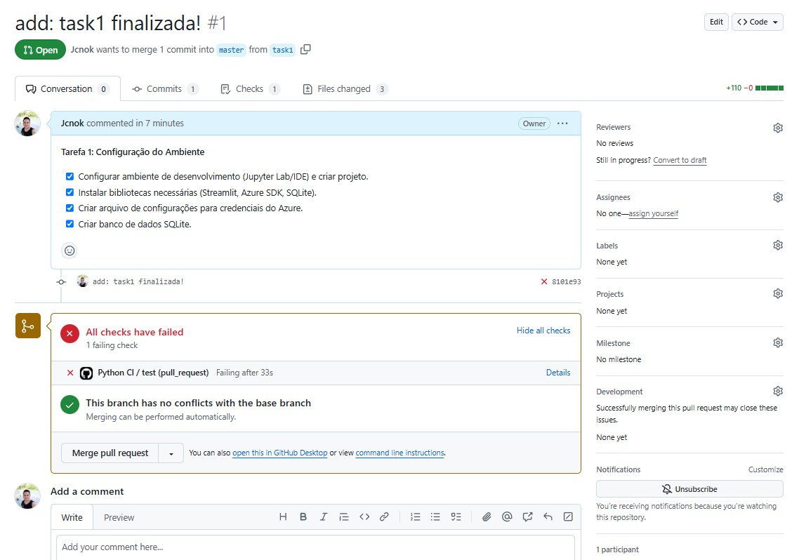
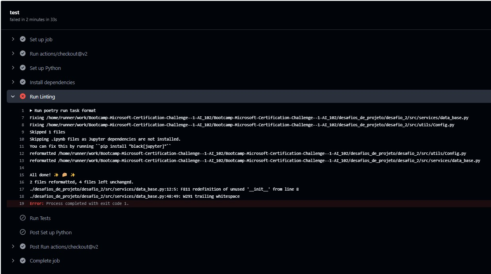
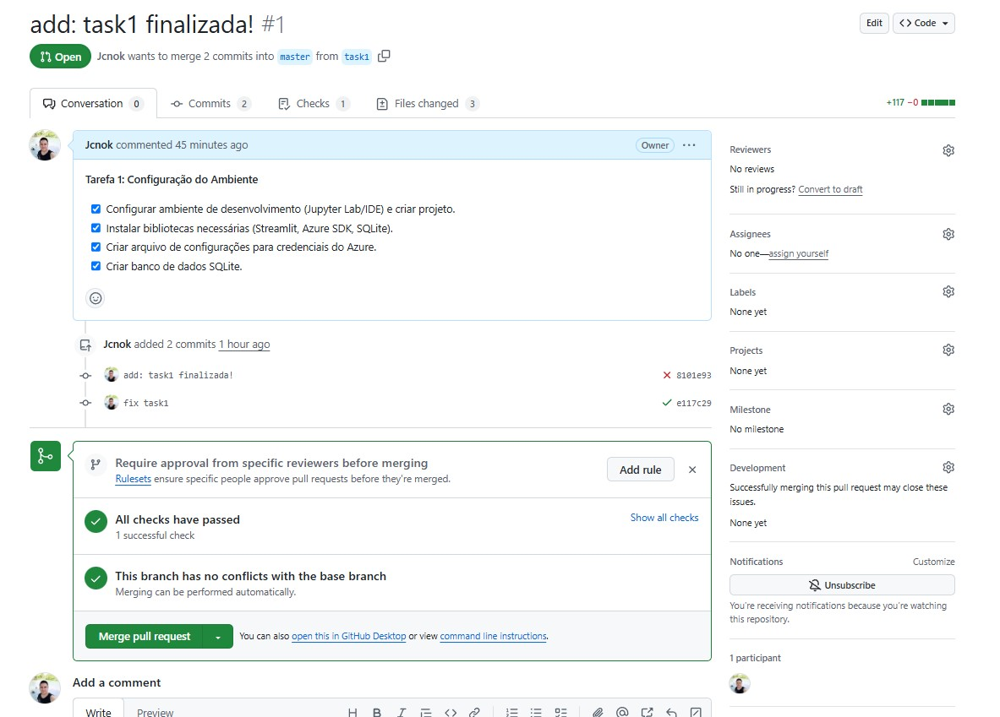

## Montei um cronograma para finalizar o desafio 2, vamos lá então!

**Vamos imaginar que comecei a trabalhar na empresa X e recebi a seguinte demanda:**

* **Você foi encarregado de criar uma Prova de Conceito (POC) para um projeto de validação de cartões de crédito. A empresa deseja adicionar uma funcionalidade para armazenar os dados dos cartões de crédito dos clientes em um banco de dados, que, para esta etapa inicial, pode ser um SQLite. Entretanto, antes de armazenar as informações, o sistema precisa validar se a imagem enviada pelo cliente realmente é de um cartão de crédito e se contém os seguintes dados: número do cartão, data de validade, nome do banco e nome do cliente.**

* **Por se tratar de uma POC, os dados capturados não serão tratados com foco na LGPD ou em outras medidas de segurança, pois essa responsabilidade será delegada a outra equipe em uma fase posterior. Seu objetivo, portanto, é entregar uma interface frontend onde o cliente possa fazer o upload de uma imagem do cartão de crédito para o Azure Blob Storage. Após o upload, o Azure fornecerá um link URL para a imagem, que será validada utilizando o serviço Azure.AI.DocumentIntelligence. Em seguida, os dados extraídos serão enviados ao banco de dados SQLite.**

* **O prazo para entrega da solução é de 2 dias.**

##  Sua Missão: Validar Cartões de Crédito com IA 

**O que você precisa fazer:**

1. **Criar um frontend simples:** Um sistema onde o cliente pode enviar uma imagem do seu cartão de crédito.
2. **Armazenar a imagem na nuvem:** Utilize o Azure Storage para guardar a imagem enviada e gerar um link URL para acessá-la.
3. **Extrair informações do cartão:** Implemente a validação usando o Azure Document Intelligence para identificar os dados do cartão, como número, data de validade, nome do banco e nome do cliente.
4. **Validar a imagem:**  Verifique se a imagem realmente corresponde a um cartão de crédito, analisando se todas as informações essenciais estão presentes.
5. **Armazenar os dados extraídos:** Utilize um banco de dados SQLite para armazenar os dados extraídos do cartão, mas lembre-se que este é apenas para fins de demonstração, a segurança de dados será tratada em uma etapa posterior.


## Cronograma para o Projeto: Validador de Cartões de Crédito

**Objetivo:** Entregar uma Prova de Conceito (POC) funcional do validador de cartões de crédito em 2 dias.

**Tempo:** 2 dias (48 horas)

**Equipes:** 1 Desenvolvedor

**Checklist Geral:**

[ ] Frontend (Interface do Usuário)
[ ] Azure Storage (Armazenamento de Imagem)
[ ] Azure Document Intelligence (Extração de Informações)
[ ] Validação da Imagem
[ ] Banco de Dados SQLite (Armazenamento de Dados)
[ ] Documentação e Apresentação


**Tarefa 1: Configuração do Ambiente**

* [ ] Configurar ambiente de desenvolvimento (Jupyter Lab/IDE) e criar projeto.
* [ ] Instalar bibliotecas necessárias (Streamlit, Azure SDK, SQLite).
* [ ] Criar arquivo de configurações para credenciais do Azure.
* [ ] Criar banco de dados SQLite.

**Tarefa 2: Frontend (Interface do Usuário)**

* [ ] Criar layout simples com Streamlit:
    * [ ] Opção de upload de arquivo de imagem.
    * [ ] Botão para iniciar a validação.
    * [ ] Área para exibir o resultado da validação.
* [ ] Adicionar instruções para o usuário.


**Tarefa 3: Upload e Armazenamento na Nuvem**

* [ ] Implementar upload de imagem para o Azure Storage:
    * [ ] Criar função para conectar ao Azure Storage.
    * [ ] Criar função para fazer o upload da imagem.
    * [ ] Gerar URL da imagem no Azure Storage.
* [ ] Exibir a URL da imagem na interface.

**Tarefa 4: Extração de Informações**

* [ ] Implementar a extração de informações do cartão:
    * [ ] Criar função para conectar ao Azure Document Intelligence.
    * [ ] Criar função para analisar a imagem do cartão.
    * [ ] Extrair informações do cartão (número, data de validade, nome do banco, nome do cliente).

**Tarefa 5: Validação da Imagem**

* [ ] Criar função para validar as informações extraídas:
    * [ ] Verificar se todas as informações essenciais foram extraídas.
    * [ ] Validar o formato dos dados (número do cartão, data, etc.).
* [ ] Exibir na interface o resultado da validação: 
    * [ ] Mensagem de sucesso se a validação for bem-sucedida.
    * [ ] Mensagem de erro caso contrário.

**Tarefa 6: Armazenamento dos Dados**

* [ ] Implementar a função para armazenar os dados no SQLite:
    * [ ] Criar tabela no banco de dados SQLite para armazenar os dados extraídos.
    * [ ] Criar função para inserir as informações extraídas no banco de dados.

**Tarefa 7: Testes e Documentação**

* [ ] Testar a POC com diferentes imagens de cartão de crédito.
* [ ] Revisar o código e corrigir erros.
* [ ] Criar documentação da POC:
    * [ ] Descrição da funcionalidade.
    * [ ] Instruções de uso.
    * [ ] Arquivos de código.
    * [ ] Diagrama da arquitetura.

**Tarefa 8: Apresentação**

* [ ] Preparar uma apresentação concisa da POC, destacando as funcionalidades e os desafios encontrados.
* [ ] Apresentar a POC para a equipe, demonstrando o funcionamento do sistema.


**Tarefa 1: Configuração do Ambiente**

* [x] Configurar ambiente de desenvolvimento (Jupyter Lab/IDE) e criar projeto.
* [x] Instalar bibliotecas necessárias (Streamlit, Azure SDK, SQLite).
* [x] Criar arquivo de configurações para credenciais do Azure.
* [x] Criar banco de dados SQLite.

**1. Configuração do ambiente:**

* [x] **Criar um ambiente virtual com Poetry:**
    ```bash
    poetry init -n
    poetry add azure-storage-blob azure-ai-documentintelligence azure-core streamlit sqlite3 python-dotenv requests
    ```
* [x] **Criar um repositório no GitHub:**
    * Acesse o GitHub e crie um novo repositório.
* [x] **Clonar o repositório localmente:**
    ```bash
    git clone <url do repositório>
    ```
* [x] **Ativar o ambiente virtual:**
    ```bash
    poetry shell
    ```

- [x] **Criar arquivo de configurações para as credenciais do Azure:**


```python
# src/utils/Config.py 
from dotenv import load_dotenv 
import os 
load_dotenv() 
class Config: 
    # Azure Document Intelligence 
    ENDPOINT =  os.getenv("AZURE_DOC_INT_ENDPOINT")
    KEY = os.getenv("AZURE_DOC_INT_KEY")
    # Azure Blob Storoge
    STORAGE_CONNECTION = os.getenv("AZURE_STORAGE_CONNECTION")
    CONTAINER_NAME = os.getenv("CONTAINER_NAME")
    # SQLite
    DATABASE_PATH = "desafio_2/data/cards.db"
```

* * **Vale lembrar que já existe um arquivo `.env` na raiz do projeto com as variáveis e seus respectivos dados de forma parcialmente segura.**
  * **Estou criando todos os módulos do projeto aqui no jupyter para futuramente usar como uma documentação.**  

* **Criar a pasta utils na do projeto:**


```python
!mkdir desafio_2/src/utils
```

* **Agora vamos enviar a célular abaixo como Config.py na pasta utils:**


```python
%%writefile  src/utils/Config.py 
from dotenv import load_dotenv 
import os 
load_dotenv() 
class Config: 
    # Azure Document Intelligence 
    ENDPOINT =  os.getenv("AZURE_DOC_INT_ENDPOINT")
    KEY = os.getenv("AZURE_DOC_INT_KEY")
    # Azure Blob Storoge
    STORAGE_CONNECTION = os.getenv("AZURE_STORAGE_CONNECTION")
    CONTAINER_NAME = os.getenv("CONTAINER_NAME")
    # SQLite
    DATABASE_PATH = "data/cards.db"
```

    Overwriting src/utils/Config.py


* [x] **Criar banco de dados SQLite.**:


```python
# src/services/data_base.py
import sqlite3
from typing import Dict, List, Optional
from src.utils.Config import Config 

class DataBase:
    def __init__(self):
        self.db_path = Config.DATABASE_PATH
        # self._create_table()
    
    def __init__(self):
        self.db_path = Config.DATABASE_PATH
        
        with sqlite3.connect(self.db_path) as conn:
            # Criar a tabela se não existir
            cursor = conn.cursor()
            cursor.execute('''
                CREATE TABLE IF NOT EXISTS credit_cards (
                    id INTEGER PRIMARY KEY AUTOINCREMENT,
                    card_name TEXT,
                    card_number TEXT,
                    expiry_date TEXT,
                    bank_name TEXT,
                    is_valid TEXT,
                    processed_at TEXT
                )
            ''')
            conn.commit()
    
    def _execute_query(self, query: str, params: tuple = None) -> sqlite3.Cursor:
        """Executa uma query SQL."""
        with sqlite3.connect(self.db_path) as conn:
            cursor = conn.cursor()
            if params:
                cursor.execute(query, params)
            else:
                cursor.execute(query)
            conn.commit()
            return cursor
    
    def insert_card(self, card_info: Dict[str, str]) -> int:
        """Insere um novo cartão no banco."""
        query = '''
        INSERT INTO credit_cards (
            card_name, card_number, expiry_date, 
            bank_name, is_valid, processed_at
        ) VALUES (?, ?, ?, ?, ?, ?)
        '''
        cursor = self._execute_query(query, (
            card_info['card_name'],
            card_info['card_number'],
            card_info['expiry_date'],
            card_info['bank_name'],
            card_info['is_valid'],
            card_info['processed_at']
        ))
        return cursor.lastrowid
    
    def get_all_cards(self) -> List[Dict[str, str]]:
        """Retorna todos os cartões."""
        query = "SELECT * FROM credit_cards"
        cursor = self._execute_query(query)
        columns = [desc[0] for desc in cursor.description]
        return [dict(zip(columns, row)) for row in cursor.fetchall()]
    
    def get_card_by_id(self, card_id: int) -> Optional[Dict[str, str]]:
        """Retorna um cartão específico."""
        query = "SELECT * FROM credit_cards WHERE id = ?"
        cursor = self._execute_query(query, (card_id,))
        row = cursor.fetchone()
        if row:
            columns = [desc[0] for desc in cursor.description]
            return dict(zip(columns, row))
        return None
    
    def update_card(self, card_id: int, card_info: Dict[str, str]) -> bool:
        """Atualiza um cartão existente."""
        query = '''
        UPDATE credit_cards
        SET card_name = ?, card_number = ?, expiry_date = ?,
            bank_name = ?, is_valid = ?, processed_at = ?
        WHERE id = ?
        '''
        cursor = self._execute_query(query, (
            card_info['card_name'],
            card_info['card_number'],
            card_info['expiry_date'],
            card_info['bank_name'],
            card_info['is_valid'],
            card_info['processed_at'],
            card_id
        ))
        return cursor.rowcount > 0
    
    def delete_card(self, card_id: int) -> bool:
        """Deleta um cartão."""
        query = "DELETE FROM credit_cards WHERE id = ?"
        cursor = self._execute_query(query, (card_id,))
        return cursor.rowcount > 0
```

* **Vamos criar a tabela e realizar alguns testes para garantir:**:

1- instanciar a classe e criar o banco caso não exista na path adicionado no Config: 


```python
db = DataBase()
```

2-  Inserir um novo cartão:


```python
card_info = {
    'card_name': 'João da Silva',
    'card_number': '1234567890123456',
    'expiry_date': '12/25',
    'bank_name': 'Banco do Brasil',
    'is_valid': 'True',
    'processed_at': '2023-10-26T10:00:00'
}
card_id = db.insert_card(card_info)
print(f"Cartão inserido com ID: {card_id}")
```

    Cartão inserido com ID: 1


3- Obter todos os cartões:


```python
cards = db.get_all_cards()
print("Todos os cartões:")
for card in cards:
    print(card)
```

    Todos os cartões:
    {'id': 1, 'card_name': 'João da Silva', 'card_number': '1234567890123456', 'expiry_date': '12/25', 'bank_name': 'Banco do Brasil', 'is_valid': 'True', 'processed_at': '2023-10-26T10:00:00'}


4- Atualizar um cartão existente:


```python
card_info['card_name'] = 'Maria da Silva'
updated = db.update_card(1, card_info)
print(f"Cartão atualizado: {updated}")
```

    Cartão atualizado: True


5- Conferir se o cartão foi atualizado:


```python
cards = db.get_all_cards()
print("Todos os cartões:")
for card in cards:
    print(card)
```

    Todos os cartões:
    {'id': 1, 'card_name': 'Maria da Silva', 'card_number': '1234567890123456', 'expiry_date': '12/25', 'bank_name': 'Banco do Brasil', 'is_valid': 'True', 'processed_at': '2023-10-26T10:00:00'}


6- Deletar um cartão: 


```python
deleted = db.delete_card(1)
print(f"Cartão deletado: {deleted}")
```

    Cartão deletado: True


* **Aparentemente o código está funcional**

* **Vamos criar a pasta services que irá acomodar nosso scritpy data_base.py:**


```python
!mkdir src/services
```

* **Agora vamos enviar o script para pasta services.**:


```python
%%writefile src/services/data_base.py
import sqlite3
from typing import Dict, List, Optional
from src.utils.Config import Config 

class DataBase:
    def __init__(self):
        self.db_path = Config.DATABASE_PATH
        # self._create_table()
    
    def __init__(self):
        self.db_path = Config.DATABASE_PATH
        
        with sqlite3.connect(self.db_path) as conn:
            # Criar a tabela se não existir
            cursor = conn.cursor()
            cursor.execute('''
                CREATE TABLE IF NOT EXISTS credit_cards (
                    id INTEGER PRIMARY KEY AUTOINCREMENT,
                    card_name TEXT,
                    card_number TEXT,
                    expiry_date TEXT,
                    bank_name TEXT,
                    is_valid TEXT,
                    processed_at TEXT
                )
            ''')
            conn.commit()
    
    def _execute_query(self, query: str, params: tuple = None) -> sqlite3.Cursor:
        """Executa uma query SQL."""
        with sqlite3.connect(self.db_path) as conn:
            cursor = conn.cursor()
            if params:
                cursor.execute(query, params)
            else:
                cursor.execute(query)
            conn.commit()
            return cursor
    
    def insert_card(self, card_info: Dict[str, str]) -> int:
        """Insere um novo cartão no banco."""
        query = '''
        INSERT INTO credit_cards (
            card_name, card_number, expiry_date, 
            bank_name, is_valid, processed_at
        ) VALUES (?, ?, ?, ?, ?, ?)
        '''
        cursor = self._execute_query(query, (
            card_info['card_name'],
            card_info['card_number'],
            card_info['expiry_date'],
            card_info['bank_name'],
            card_info['is_valid'],
            card_info['processed_at']
        ))
        return cursor.lastrowid
    
    def get_all_cards(self) -> List[Dict[str, str]]:
        """Retorna todos os cartões."""
        query = "SELECT * FROM credit_cards"
        cursor = self._execute_query(query)
        columns = [desc[0] for desc in cursor.description]
        return [dict(zip(columns, row)) for row in cursor.fetchall()]
    
    def get_card_by_id(self, card_id: int) -> Optional[Dict[str, str]]:
        """Retorna um cartão específico."""
        query = "SELECT * FROM credit_cards WHERE id = ?"
        cursor = self._execute_query(query, (card_id,))
        row = cursor.fetchone()
        if row:
            columns = [desc[0] for desc in cursor.description]
            return dict(zip(columns, row))
        return None
    
    def update_card(self, card_id: int, card_info: Dict[str, str]) -> bool:
        """Atualiza um cartão existente."""
        query = '''
        UPDATE credit_cards
        SET card_name = ?, card_number = ?, expiry_date = ?,
            bank_name = ?, is_valid = ?, processed_at = ?
        WHERE id = ?
        '''
        cursor = self._execute_query(query, (
            card_info['card_name'],
            card_info['card_number'],
            card_info['expiry_date'],
            card_info['bank_name'],
            card_info['is_valid'],
            card_info['processed_at'],
            card_id
        ))
        return cursor.rowcount > 0
    
    def delete_card(self, card_id: int) -> bool:
        """Deleta um cartão."""
        query = "DELETE FROM credit_cards WHERE id = ?"
        cursor = self._execute_query(query, (card_id,))
        return cursor.rowcount > 0
```

    Writing src/services/data_base.py


* **Bom tarefa 1 concluída, agora vamos criar uma branch e enviar para o repositório e abir a `pr` para aprovação.**


```python
!git checkout -b task1
```

    Switched to a new branch 'task1'


* **Conferindo se a branch foi setada corretamente.**:


```python
!git branch
```

      master
    * task1


* **Verificando o status**: 


```python
!git status
```

    On branch task1
    Changes not staged for commit:
      (use "git add/rm <file>..." to update what will be committed)
      (use "git restore <file>..." to discard changes in working directory)
    	deleted:    ../PoC_desafio2.ipynb
    
    Untracked files:
      (use "git add <file>..." to include in what will be committed)
    	PoC_desafio2.ipynb
    	data/cards.db
    	src/
    
    no changes added to commit (use "git add" and/or "git commit -a")


* **Adicionando ao staging todos os arquivos das pastas data e src**:


```python
!git add data/* src/*
```

* **Realizando o commit**: 


```python
!git commit -m "add: task1 finalizada!"
```

    [task1 8101e93] add: task1 finalizada!
     3 files changed, 110 insertions(+)
     create mode 100644 desafios_de_projeto/desafio_2/data/cards.db
     create mode 100644 desafios_de_projeto/desafio_2/src/services/data_base.py
     create mode 100644 desafios_de_projeto/desafio_2/src/utils/Config.py


* **Enviando as alterações para o repositório github:** 


```python
!git push origin task1
```

    Enumerating objects: 15, done.
    Counting objects: 100% (15/15), done.
    Delta compression using up to 24 threads
    Compressing objects: 100% (9/9), done.
    Writing objects: 100% (11/11), 2.12 KiB | 1.06 MiB/s, done.
    Total 11 (delta 3), reused 0 (delta 0), pack-reused 0
    remote: Resolving deltas: 100% (3/3), completed with 3 local objects.
    remote: 
    remote: Create a pull request for 'task1' on GitHub by visiting:
    remote:      https://github.com/Jcnok/Bootcamp-Microsoft-Certification-Challenge--1-AI_102/pull/new/task1
    remote: 
    To https://github.com/Jcnok/Bootcamp-Microsoft-Certification-Challenge--1-AI_102.git
     * [new branch]      task1 -> task1


* **Criando a Pull Request:**


* **Maravilha agora é so criar a `pr` e partiu....🎆**
* **Só que não 😒. A `pr` não foi aprovada pelo CI implantado.** 



* **E agora? KKKK 😂 😓.**
* **Vamos analisar clicando em detalhes**. 



* **erro de formatação como espaço em branco e algo como __init__ na linha 8 sem uso, algo desse tipo....**
* **Isso é ruim, mas importante para manter a padronização e qualidade, mas o que fazer?.**
* **Existem várias alternativas como acessar o código e resolver o problema, geralmente já existe um modelo de ambiente pré-configurado para você utilizar pela empresa, ou falar com seu chefe 🤭.**
* **Bom primeiro vou tentar resolver e depois irei comentar sobre algumas ferramentas que nos ajudam nessas horas.**


```python
# vou utilizar o isort, black e flacke8 em conjunto: 
!task format src/services/data_base.py
```

    Fixing /home/jcnok/bootcamps/Bootcamp-Microsoft-Certification-Challenge--1-AI_102/desafios_de_projeto/desafio_2/src/services/data_base.py
    Fixing /home/jcnok/bootcamps/Bootcamp-Microsoft-Certification-Challenge--1-AI_102/desafios_de_projeto/desafio_2/src/utils/Config.py
    Fixing /home/jcnok/bootcamps/Bootcamp-Microsoft-Certification-Challenge--1-AI_102/desafios_de_projeto/desafio_2/src/utils/.ipynb_checkpoints/Config-checkpoint.py
    Skipping .ipynb files as Jupyter dependencies are not installed.
    You can fix this by running ``pip install "black[jupyter]"``
    reformatted /home/jcnok/bootcamps/Bootcamp-Microsoft-Certification-Challenge--1-AI_102/desafios_de_projeto/desafio_2/src/utils/Config.py
    reformatted /home/jcnok/bootcamps/Bootcamp-Microsoft-Certification-Challenge--1-AI_102/desafios_de_projeto/desafio_2/src/services/data_base.py
    
    All done! ✨ 🍰 ✨
    2 files reformatted.
    src/services/data_base.py:12:5: F811 redefinition of unused '__init__' from line 8
    src/services/data_base.py:48:49: W291 trailing whitespace


* **Veja que resultou no mesmo erro.**
* **Vou acessar o arquivo e corrigir o erro, basicamente removi o __init__ que estava repetido e na linha 48 removi o espaço em branco.**
* **Vamos veriricar se o erro foi corrido**.


```python
!task format src/services/data_base.py
```

    Skipping .ipynb files as Jupyter dependencies are not installed.
    You can fix this by running ``pip install "black[jupyter]"``
    All done! ✨ 🍰 ✨
    2 files left unchanged.


```python
!git add src/services/data_base.py
```


```python
!git commit -m "fix task1"
```

    [task1 e117c29] fix task1
     1 file changed, 42 insertions(+), 35 deletions(-)


```python
!git push origin task1
```

    Enumerating objects: 13, done.
    Counting objects: 100% (13/13), done.
    Delta compression using up to 24 threads
    Compressing objects: 100% (6/6), done.
    Writing objects: 100% (7/7), 754 bytes | 754.00 KiB/s, done.
    Total 7 (delta 3), reused 0 (delta 0), pack-reused 0
    remote: Resolving deltas: 100% (3/3), completed with 3 local objects.
    To https://github.com/Jcnok/Bootcamp-Microsoft-Certification-Challenge--1-AI_102.git
       8101e93..e117c29  task1 -> task1




* **Resolvido**.
* **O ideal é utilizar as 🛠 de acordo com as regras já preestabelecidas, nesse caso `isort, black e flake8` irei comentar brevemente sobre:**

**`isort`, `black` , `flake8` e `taskpy`: Ferramentas Essenciais para um Código Perfeito**

* **`isort`:** Organiza as importações de seu código, agrupando-as de acordo com as melhores práticas e seguindo uma ordem definida. Isso melhora a legibilidade e consistência do código.
* **`black`:** Formata automaticamente seu código Python, garantindo que o estilo seja consistente e que as convenções de estilo sejam seguidas. É uma ferramenta rigorosa e rápida, deixando você livre para se concentrar na lógica do código.
* **`flake8`:** Verifica seu código em busca de erros de sintaxe, erros de estilo e convenções de código que podem levar a problemas de manutenção. Ele também identifica código morto e possíveis problemas de segurança.

O `taskipy` é uma biblioteca Python que facilita a criação e a execução de tarefas automatizadas dentro de seus projetos. Ele permite definir e organizar tarefas complexas em arquivos de configuração simples, tornando o processo de desenvolvimento mais organizado e eficiente.

**Vantagens de usar `taskipy`:**

* **`taskpy`:** A grosso modo, ele cria um alias ao digitar **`task format`** executa as três verficicações **`isort`, `black` , `flake8`**.

* **Mas e se eu esquecer de executar o `task format` como ocorreu no meu casso em que eu enviei ao repositório github e ocorreu o erro?**.

* **Bom pra isso existe outra 🛠 , o `pre-commit`:

O `pre-commit` é uma ferramenta poderosa que automatiza a execução de hooks (ganchos) antes de cada commit no Git. Esses hooks são scripts que verificam seu código em busca de erros, estilo inconsistente, problemas de segurança, etc., antes de você enviar as alterações para o repositório.

**Importância do `pre-commit`:**

* **Garante a qualidade do código:** Detecta erros e problemas de estilo antes de o código ser enviado para o repositório, evitando que problemas sérios se propaguem.
* **Padroniza o código:** Assegura que todos os membros da equipe seguem as mesmas convenções de estilo, tornando o código mais consistente e legível.
* **Economiza tempo:** Automatiza tarefas repetitivas de formatação e verificação, liberando você para se concentrar em escrever código.
* **Melhora a colaboração:** Facilita a colaboração entre os desenvolvedores, pois todos podem ter certeza de que o código está sendo enviado com a qualidade desejada.
* **Detecta problemas de segurança:** Algumas ferramentas do `pre-commit` podem identificar vulnerabilidades de segurança no código, ajudando a construir software mais seguro.

### Em outro momento eu demosntro o funcionamento do `pre-commit` mas basicamente ele faz a verificação durante o commit e isso garante e nos obriga a correção antes mesmo de enviar ao github.
### Vou ficando por aqui, se gostaram fico grato com um voto de confiança ✅. Valeuuuuuu...  


```python

```


```python

```


```python

```


```python

```


```python

```


```python

```

**Tarefa 2: Frontend (Interface do Usuário)**

* [ ] Criar layout simples com Streamlit:
    * [ ] Opção de upload de arquivo de imagem.
    * [ ] Botão para iniciar a validação.
    * [ ] Área para exibir o resultado da validação.
* [ ] Adicionar instruções para o usuário.


```python

```


```python
# src/utils/Config.py 
from dotenv import load_dotenv 
import os 
load_dotenv() 
class Config: 
    # Azure Document Intelligence 
    ENDPOINT =  os.getenv("AZURE_DOC_INT_ENDPOINT")
    KEY = os.getenv("AZURE_DOC_INT_KEY")
    # Azure Blob Storoge
    STORAGE_CONNECTION = os.getenv("AZURE_STORAGE_CONNECTION")
    CONTAINER_NAME = os.getenv("CONTAINER_NAME")
    # SQLite
    DATABASE_PATH = "data/cards.db" 
```


```python

```


```python
# src/services/blob_service.py 
from azure.storage.blob import BlobServiceClient 
# from urllib import urllib
import requests 
# from src.utils.Conifig import Config
import uuid 

class BlobService: 
    def __init__(self):
        self.blob_service_client = BlobServiceClient.from_connection_string(Config.STORAGE_CONNECTION) 
        self.container_client = self.blob_service_client.get_container_client(Config.CONTAINER_NAME) 
    def upload_to_blob(self, source, filename=None) -> str: 
        try: 
            if isinstance(source, str) and (source.startswith('http://') or source.startswith('https://')): 
                response = requests.get(source)
                content = response.content 
                if not filename:
                    filename = urlparse(source).path.split('/')[-1] 
            else:
                content = source.read() 
                if not filename: 
                    filename = source.name 
            extension = filename.split('.')[-1] 
            blob_name = f"{uuid.uuid4()}.{extension}" 
            # Upload para o blob
            blob_client = self.container_client.get_blob_client(blob_name)
            blob_client.upload_blob(content, overwrite=True)
            
            return blob_client.url
            
        except Exception as e:
            raise Exception(f"Erro no upload para blob: {str(e)}")
```


```python
BlobService.upload_to_blob("desafios_de_projeto/desafio_2/data/cartao-pre-pago-standard.jpg", "imagen2.jpg")
```


    ---------------------------------------------------------------------------

    AttributeError                            Traceback (most recent call last)

    Cell In[5], line 20, in BlobService.upload_to_blob(self, source, filename)
         19 else:
    ---> 20     content = source.read() 
         21     if not filename: 


    AttributeError: 'str' object has no attribute 'read'

    
    During handling of the above exception, another exception occurred:


    Exception                                 Traceback (most recent call last)

    Cell In[6], line 1
    ----> 1 BlobService.upload_to_blob("desafios_de_projeto/desafio_2/data/cartao-pre-pago-standard.jpg", "imagen2.jpg")


    Cell In[5], line 32, in BlobService.upload_to_blob(self, source, filename)
         29     return blob_client.url
         31 except Exception as e:
    ---> 32     raise Exception(f"Erro no upload para blob: {str(e)}")


    Exception: Erro no upload para blob: 'str' object has no attribute 'read'


```python
# src/services/blob_service.py
from azure.storage.blob import BlobServiceClient, ContentSettings
from urllib.parse import urlparse
import requests
import uuid
import os

class BlobService:
    def __init__(self):
        self.blob_service_client = BlobServiceClient.from_connection_string(
            Config.STORAGE_CONNECTION
        )
        self.container_client = self.blob_service_client.get_container_client(
            Config.CONTAINER_NAME
        )
    
    def upload_to_blob(self, source, filename=None) -> str:
        """
        Faz upload de uma imagem para o Azure Blob Storage.
        
        Args:
            source: Pode ser uma URL, um caminho de arquivo local, ou um arquivo de imagem aberto.
            filename: Nome opcional do arquivo
            
        Returns:
            str: URL do blob
        """
        try:
            if isinstance(source, str) and (source.startswith('http://') or source.startswith('https://')):
                # Se for URL, baixa a imagem
                response = requests.get(source)
                content = response.content
                if not filename:
                    filename = urlparse(source).path.split('/')[-1]
            elif isinstance(source, str) and os.path.isfile(source):
                # Se for um caminho de arquivo local
                with open(source, "rb") as file:
                    content = file.read()
                if not filename:
                    filename = os.path.basename(source)
            else:
                # Se for um arquivo aberto (objeto de arquivo)
                content = source.read()
                if not filename:
                    filename = source.name
            
            # Gera um nome único para o arquivo
            extension = filename.split('.')[-1]
            blob_name = f"{uuid.uuid4()}.{extension}"

            # Define o Content-Type com base na extensão do arquivo
            content_type = "image/jpeg" if extension.lower() == "jpg" or extension.lower() == "jpeg" else f"image/{extension.lower()}"
            
            # Upload para o blob com Content-Type apropriado
            blob_client = self.container_client.get_blob_client(blob_name)
            blob_client.upload_blob(
                content,
                overwrite=True,
                content_settings=ContentSettings(content_type=content_type)
            )
            
            return blob_client.url
            
        except Exception as e:
            raise Exception(f"Erro no upload para blob: {str(e)}")

```


```python
blob_service = BlobService()
image_url = blob_service.upload_to_blob("https://stdiolab2.blob.core.windows.net/cartoes/imgagem.png")
```


```python
image_url
```


    'https://stdiolab2.blob.core.windows.net/cartoes/9ee8b449-afee-442c-a4e6-67c539031b50.png'


```python
blob_service = BlobService()
image_url = blob_service.upload_to_blob("desafio_2/data/cartao-pre-pago-standard.jpg")
```


```python
image_url
```


    'https://stdiolab2.blob.core.windows.net/cartoes/c0b2dbb7-f7b8-4745-a728-b0cc6a32297b.jpg'


```python

```
