# Guia passo a passo para obter os recuros da Azure para o projeto
## 🚀 Bootcamp Microsoft Certification Challenge AI-102

### Para que seja possível a replicação desse projeto é necessário obter as  credenciais dos serviços da Azure e adicionar ao arquivo .env:
* `AZURE_DOC_INT_ENDPOINT` -> Document Intelligence endpoint
* `AZURE_DOC_INT_KEY`-> Document Intelligence key
* `AZURE_STORAGE_CONNECTION`-> Storage connection string
* `CONTAINER_NAME`-> Container name

1. **passo1**: Criar um grupo de recursos
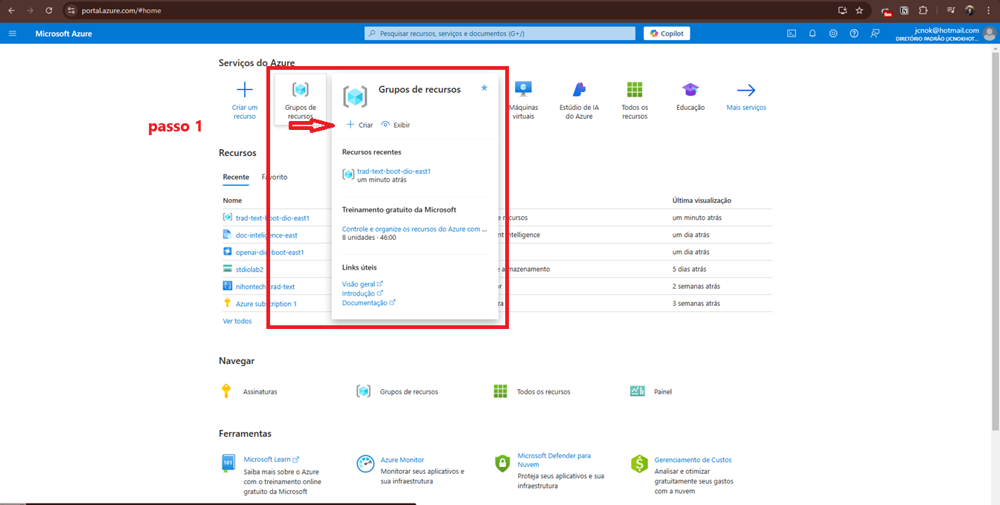

2. **passo2**: Criar o serviço de document intelligence para obte a key e o endpoint.
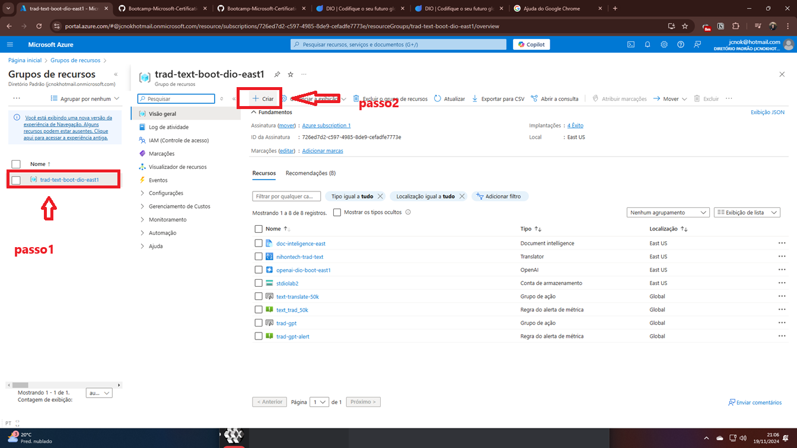
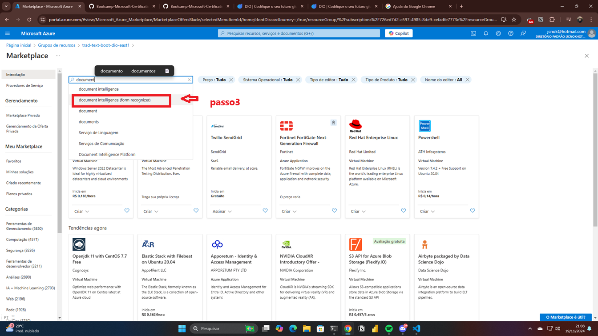
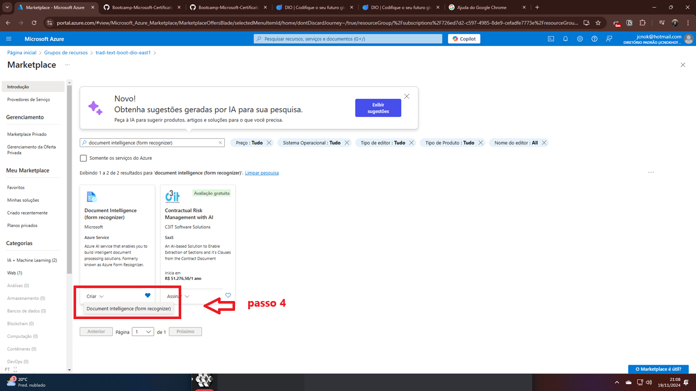
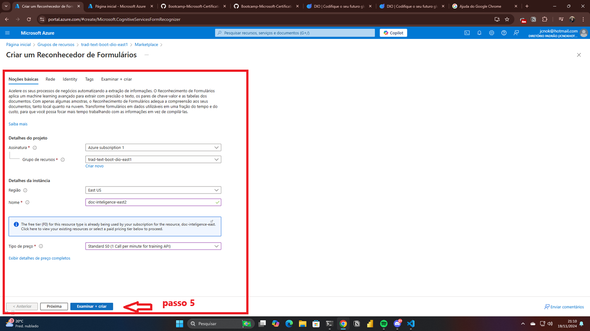

3. **passo3**: No mesmo grupo de recursos criar o serviço de storage: 
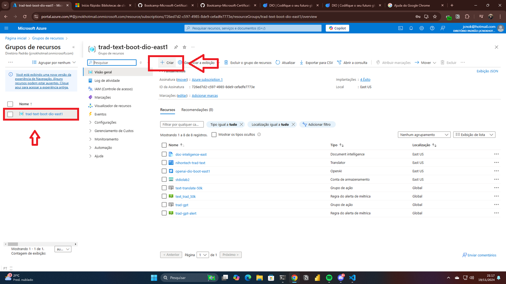
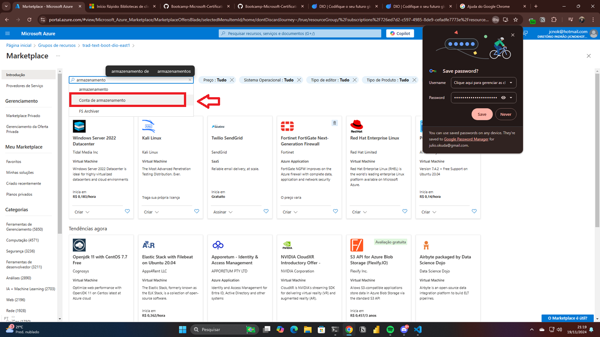
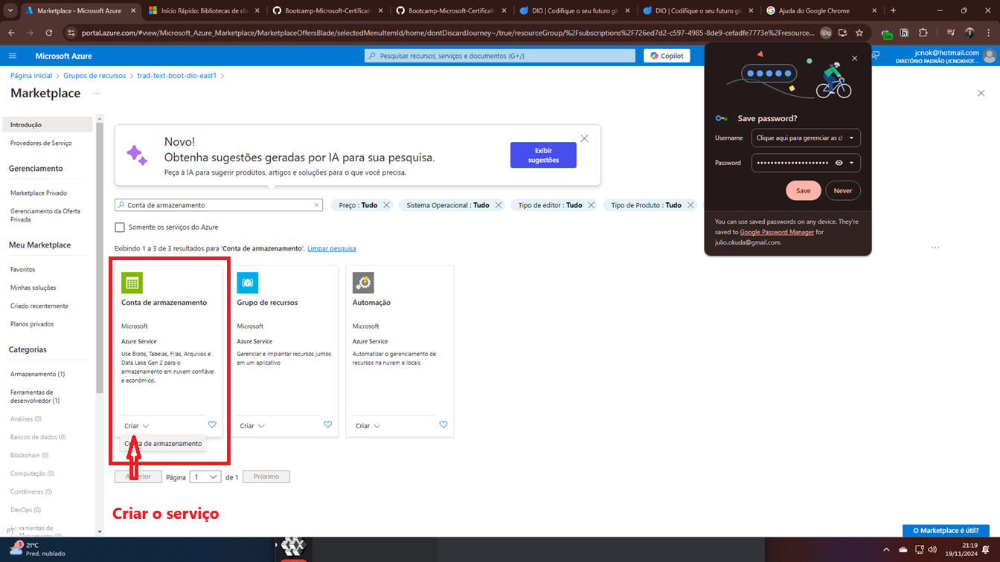
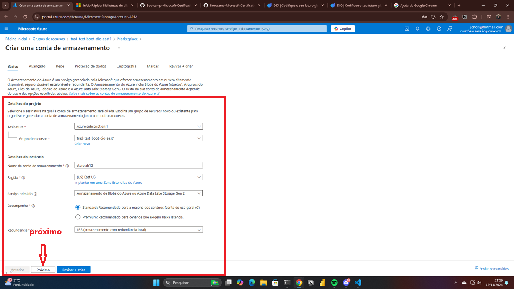
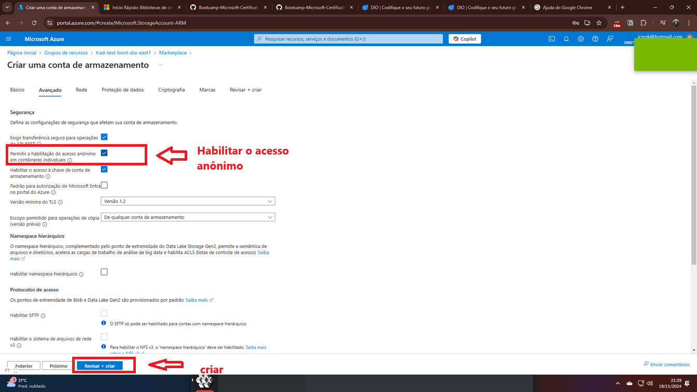
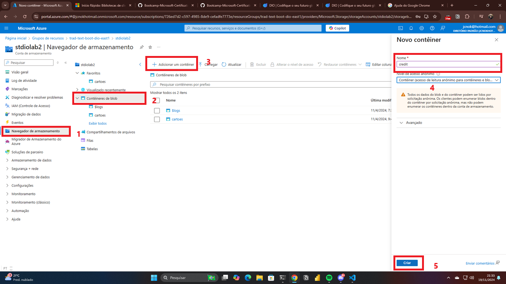
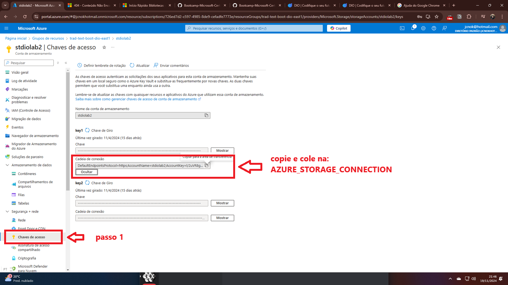
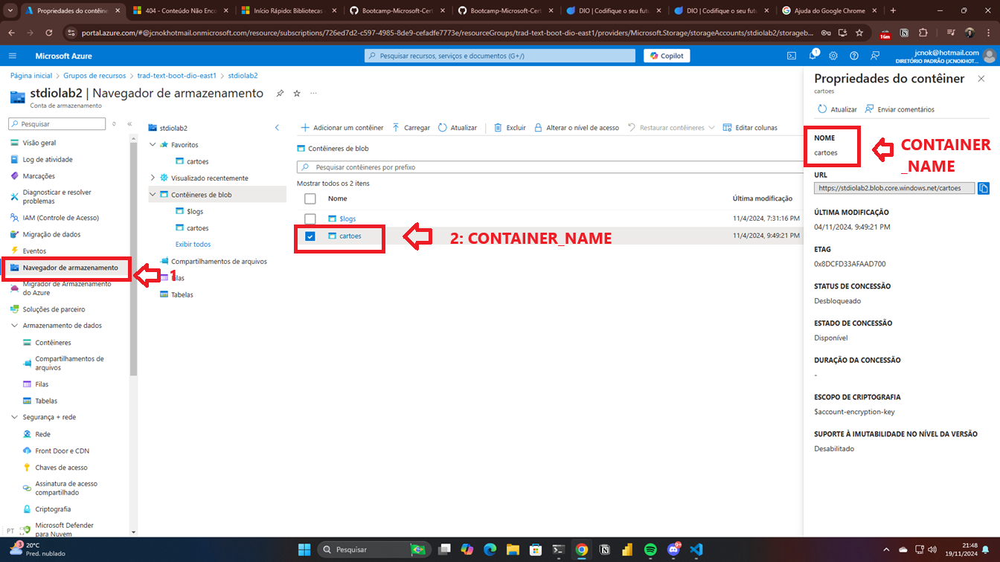

