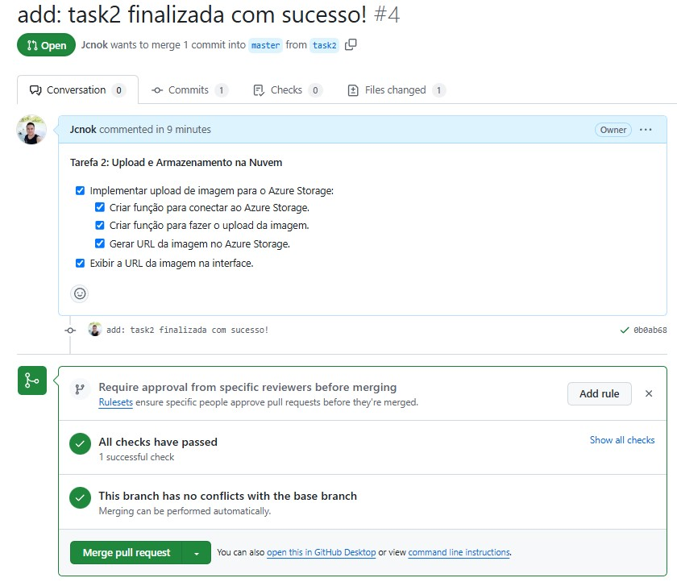

## Task 2:

**Tarefa 2: Upload e Armazenamento na Nuvem**

* [x] Implementar upload de imagem para o Azure Storage:
    * [x] Criar função para conectar ao Azure Storage.
    * [x] Criar função para fazer o upload da imagem.
    * [x] Gerar URL da imagem no Azure Storage.
* [x] Exibir a URL da imagem na interface.

## Implementar upload de imagem para o Azure Storage:

### 1.Criar função para conectar ao Azure Storage

* **Primeiro vamos carregar nossas variáveis de ambiente da Config.py**


```python
from src.utils.Config import Config
```

* **Agora vamos conferir se a variável foi carregada corretamente**: 


```python
Config.CONTAINER_NAME
```


    'cartoes'


* **Perfeito, inclusive acima já respondo a questão de usar Dotenv é uma forma parcialmente segura de utilizar keys.**

* **Bom agora percisamos criar uma conexão com nosso azure storage vamos lá na documentação e vamos descobrir qual a forma mais simples de realizar essa conexão.**
* [documentação](https://learn.microsoft.com/en-us/azure/storage/blobs/storage-quickstart-blobs-python?tabs=managed-identity%2Croles-azure-portal%2Csign-in-azure-cli&pivots=blob-storage-quickstart-scratch)


```python
# importação da lib para conexão:  
from azure.storage.blob import BlobServiceClient
```


```python
BlobServiceClient.from_connection_string()
```

### Criando a conexão com  o blob storage da azure:

**BlobServiceClient.from_connection_string("nossa string de conexão")**

* **Exitem outras formas de criar a conexão mas vou usar essa que achei mais simples:**

* **BlobServiceClient : esse cara é a classe que irá criar nossa conexão para isso precisamos fornecer string de conexão que está na nossa variável Config.STORAGE_CONNECTION**    


```python
# criando a conexão:
blob_service_client = BlobServiceClient.from_connection_string(Config.STORAGE_CONNECTION)
```

* **Certo agora vamos conferir se a conexão está ativa e verificar o que tenho no container.**:


```python
# Verificano o que tenho dentro do meu container de nome cartão:
container_client = blob_service_client.get_container_client(container=Config.CONTAINER_NAME)
blob_list = container_client.list_blobs()
for blob in blob_list:
    print(f"Name: {blob.name}")
```

    Name: 6dcbfb18-a936-45b6-96aa-18c97a780943.jpg
    Name: 9ee8b449-afee-442c-a4e6-67c539031b50.png
    Name: c0b2dbb7-f7b8-4745-a728-b0cc6a32297b.jpg
    Name: cartao-pre-pago-standard.jpg
    Name: credit-card-horizontal[1].png
    Name: imgagem.png


* **Como podem ver a conexão foi criada com sucesso, pois foi possível listar todos os arquivos do container cartão.**

### 2.Criar função para fazer o upload da imagem.

* **Agora bora lá pra documentação e verificar qual a classe para realizar upload.**

* **Enviando um texto para um bloco do blob:**


```python
# vamos testar este exemplo simples
blob_client = blob_service_client.get_blob_client(Config.CONTAINER_NAME, blob="teste_upload.txt")
data = b"Vamos enviar esse texto no nosso container pra ver o que acontece."

# Upload the blob data - default blob type is BlockBlob
blob_client.upload_blob(data, blob_type="BlockBlob")
```


    {'etag': '"0x8DCFE76967847F9"',
     'last_modified': datetime.datetime(2024, 11, 6, 15, 20, 46, tzinfo=datetime.timezone.utc),
     'content_md5': bytearray(b'\x14\x03\x84\x96z\xd4\x8a\xea\x07\x15c7(\xd2I\xe5'),
     'client_request_id': '50428478-9c51-11ef-b397-7f38ab652918',
     'request_id': '068094c3-c01e-0089-475f-30d7c0000000',
     'version': '2024-11-04',
     'version_id': None,
     'date': datetime.datetime(2024, 11, 6, 15, 20, 46, tzinfo=datetime.timezone.utc),
     'request_server_encrypted': True,
     'encryption_key_sha256': None,
     'encryption_scope': None}


* **Recuperando o arquivo salvo no storage:**


```python
blob_client = blob_service_client.get_blob_client(container=Config.CONTAINER_NAME, blob="teste_upload.txt")
# encoding param is necessary for readall() to return str, otherwise it returns bytes
downloader = blob_client.download_blob(max_concurrency=1, encoding='UTF-8')
blob_text = downloader.readall()
print(f"Blob contents: {blob_text}")
```

    Blob contents: Vamos enviar esse texto no nosso container pra ver o que acontece.


* **Legal mas no nosso caso precisamos enviar uma imagem!**
* **Vamos experimentar e ver se o mesmo método funciona.**


```python
blob_client = blob_service_client.get_blob_client(Config.CONTAINER_NAME, 'foto.png')
blob_client.upload_blob("data/cartao-pre-pago-standard.jpg", overwrite=True)
blob_client.url
```


    'https://stdiolab2.blob.core.windows.net/cartoes/foto.png'


* **Aparentemente ele enviou o arquivo e retornou uma url da imagem.**
* **Vamos abrir a imagem para verificar**.


* **Como o link não contém a imagem e muito menos o storage**.
* **Para que funcione corretamente, é necessário abrir o arquivo com with open primeiro para depois enviarmos para o storage.**


```python
blob_client = blob_service_client.get_blob_client(Config.CONTAINER_NAME, 'foto.png')
# Upload the created file
with open(file="data/cartao-pre-pago-standard.jpg", mode="rb") as data:
    blob_client.upload_blob(data, overwrite=True)
blob_client.url
```


    'https://stdiolab2.blob.core.windows.net/cartoes/foto.png'


* **Perfeito! Agora precisamos criar uma função e salvar o script em src/services/blob_service.py**


```python
# %%writefile src/services/blob_service.py
from azure.storage.blob import BlobServiceClient 
from src.utils.Config import Config 

def upload_to_blob(source, filename=None) -> str:
    """
    Faz o upload de uma imagem para o Azure Blob Storage

    Args:
        source: imagem com o caminho completo. ex:"img/imagem.png" 
        filename:Nome opcional para o arquivo.

    Returns: 
        str: URL do blob
    """ 
    if not filename:        
        file = source.split('.')[0].split('/')[-1]
        extension = source.split('.')[-1]
        filename = f"{file}.{extension}"
        
    # Upload para o blob
    blob_service_client = BlobServiceClient.from_connection_string(Config.STORAGE_CONNECTION)
    blob_client = blob_service_client.get_blob_client(Config.CONTAINER_NAME, filename)
    with open(file="data/cartao-pre-pago-standard.jpg", mode="rb") as data:
        blob_client.upload_blob(data, overwrite=True)
    return blob_client.url
```

    Writing src/services/blob_service.py


* **Para desencargo de consciência vamos fazer um último teste:**


```python
# Coloquei propositalmente sem o nome do arquivo para ver se será tratado corretamente pois eu deixei como opcional.
upload_to_blob("data/cartao-pre-pago-standard.jpg") 
```


    'https://stdiolab2.blob.core.windows.net/cartoes/cartao-pre-pago-standard.jpg'


### **Bom acho que ficou bem simples e prático, tentei reduzir ao máximo o código e não fiz nenhum tipo de tratamento para ficar o mais simples possível, pois acho que compliquei um pouco na tarefa 1 .😅.**

* **Mas calma aí, vamos fazer o commit e a PR para encerrarmos com chave de 🥇 essa tarefa.** 
* **Criar a branch da tarefa 2.**
* **Mas antes de tudo vamos verficar a qualidade do código para não sermos barrados na Pull Request como foi na task1 😓.**


```python
!task format src/services/blob_service.py
```

    Skipping .ipynb files as Jupyter dependencies are not installed.
    You can fix this by running ``pip install "black[jupyter]"``
    All done! ✨ 🍰 ✨
    3 files left unchanged.


All done! ✨ 🍰 ✨

**Agora sim!.🎆

**Criar a branch task2**:


```python
!git checkout -b task2
```

    Switched to a new branch 'task2'


```python
!git branch
```

      master
      task1
    * task2


```python
!git status
```

    On branch task2
    Changes not staged for commit:
      (use "git add <file>..." to update what will be committed)
      (use "git restore <file>..." to discard changes in working directory)
    	modified:   PoC_desafio2.ipynb
    
    Untracked files:
      (use "git add <file>..." to include in what will be committed)
    	src/services/blob_service.py
    
    no changes added to commit (use "git add" and/or "git commit -a")


**Adicionar ao stage e realizando o commit local.**


```python
!git add src/services/blob_service.py
```


```python
!git commit -m "add: task2 finalizada com sucesso!"
```

    [task2 0b0ab68] add: task2 finalizada com sucesso!
     1 file changed, 29 insertions(+)
     create mode 100644 desafios_de_projeto/desafio_2/src/services/blob_service.py


**Enviando para o github.**


```python
!git push origin task2
```

    Enumerating objects: 12, done.
    Counting objects: 100% (12/12), done.
    Delta compression using up to 24 threads
    Compressing objects: 100% (7/7), done.
    Writing objects: 100% (7/7), 1.02 KiB | 1.02 MiB/s, done.
    Total 7 (delta 2), reused 0 (delta 0), pack-reused 0
    remote: Resolving deltas: 100% (2/2), completed with 2 local objects.
    remote: 
    remote: Create a pull request for 'task2' on GitHub by visiting:
    remote:      https://github.com/Jcnok/Bootcamp-Microsoft-Certification-Challenge--1-AI_102/pull/new/task2
    remote: 
    To https://github.com/Jcnok/Bootcamp-Microsoft-Certification-Challenge--1-AI_102.git
     * [new branch]      task2 -> task2


**Abrindo a PR.**




### Bom vou ficando por aqui, em breve estarei postando as  próximas tarefas, se gostaram não esqueçam de curtir! 🙏🏻 Fui.....🏃🏻‍➡️
